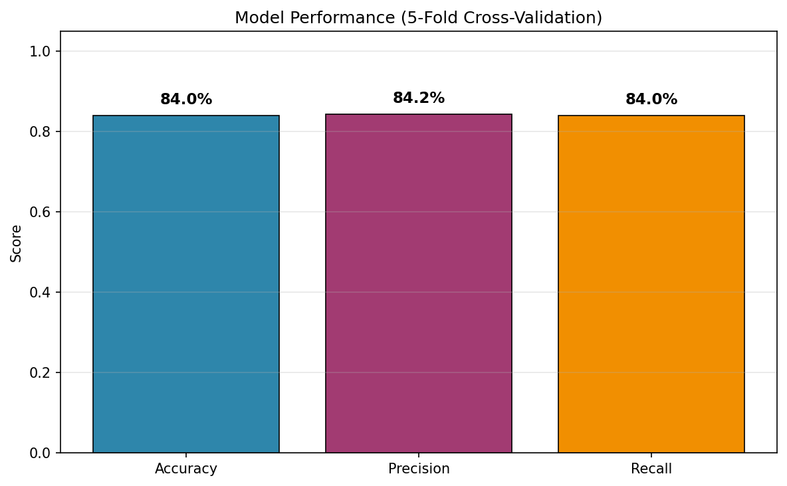
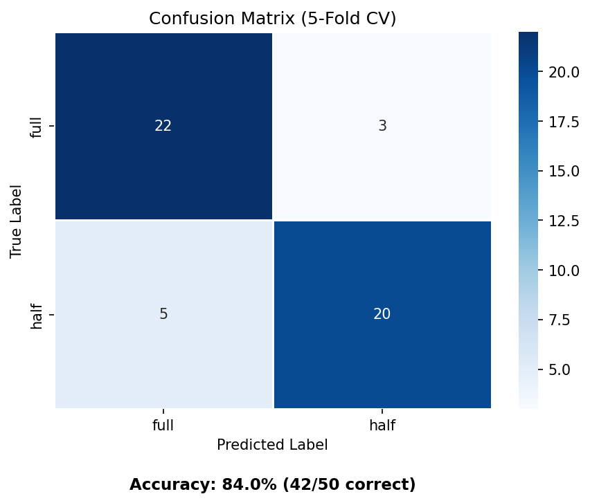
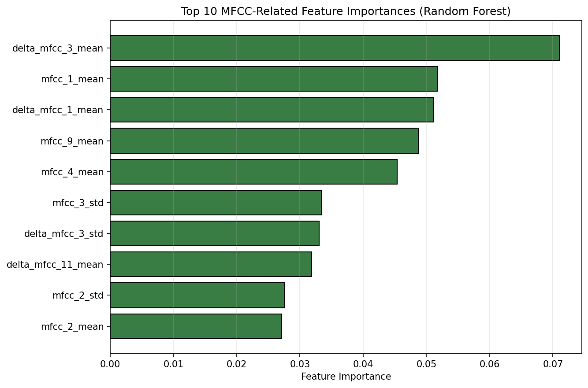

# Water Container Audio Classification Project Report

## 1. Introduction

This project builds a **classical machine learning pipeline** to classify audio recordings of water containers as either **full** or **half** based on sound alone. The system uses hand-crafted audio features (MFCC, Delta MFCC, pitch, spectral centroid, energy, and zero-crossing rate) and a **Random Forest** classifier.

No deep learning is used. The goal is to demonstrate a complete DSP + ML workflow: audio loading, feature extraction, model training, cross-validation, visualization, and reporting.

---

## 2. Problem Statement

Given a short audio recording of a water container (glass, hard plastic, paper, thermos, or thin plastic), predict whether the container is:

- **Full** — mostly filled with water
- **Half** — partially filled with water

This is a **binary classification** task. Material type is recorded in the dataset but is **not** used as an input feature during training — the model must generalize across different container materials using only acoustic properties.

---

## 3. Dataset

### 3.1 Source

All recordings are stored as `.m4a` files in the project directory. Labels and materials are encoded in filenames using the pattern:

```
{material}_{full|half}{number}.m4a
```

**Examples:**
- `glass_half1.m4a` → material: glass, label: half
- `paper_full1.m4a` → material: paper, label: full
- `hard _plastic_full1.m4a` → material: hard_plastic, label: full

### 3.2 Dataset Summary

| Property | Value |
|----------|-------|
| Total samples | 50 |
| Materials | 5 (glass, hard_plastic, paper, thermos, thin_plastic) |
| Recordings per material | 10 (5 full + 5 half) |
| Class balance | 25 full, 25 half (balanced) |
| Sample rate | 22,050 Hz (mono) |

### 3.3 Extracted Features File

All extracted features are saved to **`audio_features.csv`**, which contains:

- `filename`, `material`, `label`
- 60 numeric feature columns (see Section 4)

---

## 4. Feature Extraction

Each audio file is decoded via **ffmpeg** (required for `.m4a` on Windows), then processed with **librosa**. The following **classical audio features** are extracted per file:

### 4.1 MFCC (Mel-Frequency Cepstral Coefficients)

- 13 MFCC coefficients computed over time
- For each coefficient: **mean** and **standard deviation**
- Total: **26 features** (`mfcc_1_mean` … `mfcc_13_std`)

MFCCs capture the timbre and spectral envelope of the sound — useful for distinguishing resonance patterns between full and half containers.

### 4.2 Delta MFCC (First-Order Derivative)

- Computed using `librosa.feature.delta()` on the MFCC matrix
- Captures **how MFCCs change over time** (temporal dynamics)
- For each of 13 delta coefficients: **mean** and **std**
- Total: **26 features** (`delta_mfcc_1_mean` … `delta_mfcc_13_std`)

Delta MFCC adds temporal information that static MFCC statistics alone may miss — for example, how quickly the sound decays or shifts in frequency.

### 4.3 Additional Features

| Feature | Description | Count |
|---------|-------------|-------|
| Pitch (YIN) | Mean and std of fundamental frequency | 2 |
| Spectral Centroid | Mean and std of brightness / center of mass | 2 |
| Energy (RMS) | Mean and std of signal loudness | 2 |
| Zero-Crossing Rate | Mean and std of sign-change rate | 2 |

### 4.4 Total Feature Count

**60 features** per sample (26 MFCC + 26 Delta MFCC + 8 other).

---

## 5. Signal Processing: STFT Spectrogram

To visualize the frequency content of a representative recording, a **Short-Time Fourier Transform (STFT)** was applied to `paper_full1.m4a`.

**STFT parameters:**
- `n_fft = 2048`
- `hop_length = 512`
- Frequency range displayed: **0–8000 Hz**
- Magnitude displayed in decibels (dB)

The spectrogram shows how energy is distributed across time and frequency. Full containers typically produce longer, more resonant sounds with distinct low-frequency components compared to half containers.


**Figure 1:** STFT spectrogram of a representative full paper container recording (`paper_full1.m4a`), limited to 0–8000 Hz. Saved as `figures/spectrogram_report.png`.

---

## 6. Machine Learning Model

### 6.1 Algorithm

**Random Forest Classifier** with the following settings:

| Parameter | Value |
|-----------|-------|
| `n_estimators` | 200 |
| `max_depth` | None (unlimited) |
| `class_weight` | balanced |
| `random_state` | 42 |

### 6.2 Preprocessing Pipeline

```
Raw features (60 values)
  → StandardScaler (zero mean, unit variance)
  → Random Forest (200 decision trees, majority vote)
  → Prediction: "full" or "half"
```

Each decision tree learns simple threshold rules on scaled features. The final prediction is the **majority vote** across all 200 trees.

### 6.3 Evaluation Method

**5-fold stratified cross-validation** (`StratifiedKFold`, shuffle=True, random_state=42):

- The dataset is split into 5 folds preserving class proportions
- Each fold is used once as a test set
- Predictions are aggregated across all folds for final metrics
- This avoids overfitting to a single train/test split on a small dataset

---

## 7. Results

### 7.1 Overall Performance

Results below are from a full re-run of the pipeline on all **50 `.m4a` files** (25 full, 25 half) using 5-fold stratified cross-validation.

| Metric | Score |
|--------|-------|
| **Accuracy** | **84.0%** |
| **Precision (weighted)** | **84.2%** |
| **Recall (weighted)** | **84.0%** |
| **Correct predictions** | **42 / 50** |



**Figure 2:** Accuracy, precision, and recall from 5-fold cross-validation on all 50 recordings. Saved as `figures/results_metrics.png`.

### 7.2 Confusion Matrix

|  | Predicted: full | Predicted: half |
|--|-----------------|-----------------|
| **Actual: full** | 22 | 3 |
| **Actual: half** | 5 | 20 |



**Figure 3:** Confusion matrix heatmap from 5-fold cross-validation. Saved as `figures/confusion_matrix.png`.

### 7.3 Per-Class Breakdown

| Class | Precision | Recall | F1-Score | Support |
|-------|-----------|--------|----------|---------|
| full | 0.81 | 0.88 | 0.85 | 25 |
| half | 0.87 | 0.80 | 0.83 | 25 |

**Interpretation:**
- The model detects **full** containers well (88% recall) but misclassifies 3 full samples as half.
- **Half** containers are harder to recall (80%) — 5 half samples are misclassified as full.
- Overall, 42 out of 50 samples are classified correctly.

### 7.4 Feature Importance (Top 10 MFCC-Related Features)

The Random Forest ranks features by how much they reduce impurity across all trees. The top MFCC-related features are:

| Rank | Feature | Importance |
|------|---------|------------|
| 1 | delta_mfcc_3_mean | 7.10% |
| 2 | mfcc_1_mean | 5.17% |
| 3 | delta_mfcc_1_mean | 5.12% |
| 4 | mfcc_9_mean | 4.87% |
| 5 | mfcc_4_mean | 4.54% |
| 6 | mfcc_3_std | 3.33% |
| 7 | delta_mfcc_3_std | 3.30% |
| 8 | delta_mfcc_11_mean | 3.18% |
| 9 | mfcc_2_std | 2.75% |
| 10 | mfcc_2_mean | 2.71% |



**Figure 4:** Top 10 MFCC-related feature importances from the trained Random Forest. Delta MFCC features rank highest, confirming the value of temporal dynamics. Saved as `figures/mfcc_feature_importance.png`.

---

## 8. How the Model Makes Decisions

1. **Audio is converted to numbers:** Each `.m4a` file becomes a 60-dimensional feature vector summarizing its spectral and temporal properties.
2. **Features are normalized:** `StandardScaler` ensures all features contribute on a comparable scale.
3. **200 trees vote independently:** Each tree applies a series of if/else splits (e.g., "if delta_mfcc_3_mean > 0.5, go left; else go right") until it reaches a leaf node with a class prediction.
4. **Majority vote wins:** The class predicted by the most trees becomes the final output.

**Key insight:** Delta MFCC features (especially `delta_mfcc_3_mean`) are the most discriminative, meaning the **rate of change** in certain spectral bands differs systematically between full and half containers. Pitch and static MFCCs also contribute significantly.

---

## 9. Project Files

| File | Description |
|------|-------------|
| `train_classifier.py` | Main pipeline script |
| `requirements.txt` | Python dependencies |
| `audio_features.csv` | Extracted features for all 50 samples |
| `full_half_classifier.joblib` | Trained model (pipeline + metadata) |
| `figures/results_metrics.png` | Performance metrics bar chart |
| `figures/confusion_matrix.png` | Confusion matrix heatmap |
| `figures/mfcc_feature_importance.png` | Top 10 MFCC feature importances |
| `figures/spectrogram_report.png` | STFT spectrogram (0–8000 Hz) |
| `report.md` | This report |

---

## 10. Reproducibility

Install dependencies and run the full pipeline:

```powershell
pip install -r requirements.txt
python train_classifier.py
```

This will:
1. Scan all `.m4a` files
2. Extract MFCC + Delta MFCC + other features
3. Save `audio_features.csv`
4. Train and evaluate with 5-fold cross-validation
5. Save the model to `full_half_classifier.joblib`
6. Generate all figures in the `figures/` directory

**Note:** `.m4a` decoding requires ffmpeg, bundled automatically via the `imageio-ffmpeg` package.

---

## 11. Limitations

1. **Small dataset:** Only 50 samples (5 per class per material) limits generalization.
2. **Cross-validation variance:** Metrics may shift with different random seeds or fold assignments.
3. **Material overlap:** Some materials may produce similar sounds at full/half levels, causing misclassification.
4. **Recording conditions:** Background noise, microphone distance, and tap force are not controlled.
5. **Misclassification rate:** 8 out of 50 samples were misclassified (3 full → half, 5 half → full).

---

## 12. Conclusions

This project successfully demonstrates a complete classical ML pipeline for audio-based water level classification:

- **60 hand-crafted features** (including MFCC and Delta MFCC) were extracted from 50 container recordings.
- A **Random Forest** classifier achieved **84% accuracy** with balanced precision and recall using 5-fold cross-validation.
- **Delta MFCC features** proved most important, highlighting the value of temporal spectral dynamics.
- **STFT spectrogram analysis** confirmed visible frequency differences in representative recordings.
- All results, features, model, and figures are saved for reproducibility and submission.

---

## 13. Future Work

1. Collect more recordings per class to improve generalization and reduce misclassifications.
2. Compare Random Forest vs. SVM performance (SVM support is built into the script).
3. Add **Delta-Delta MFCC** (second-order derivatives) for additional temporal detail.
4. Perform **leave-one-material-out** evaluation to test cross-material generalization.
5. Extend to **multi-class material classification** as a separate task.

---

*Report generated for the Water Container Audio Classification project.*
